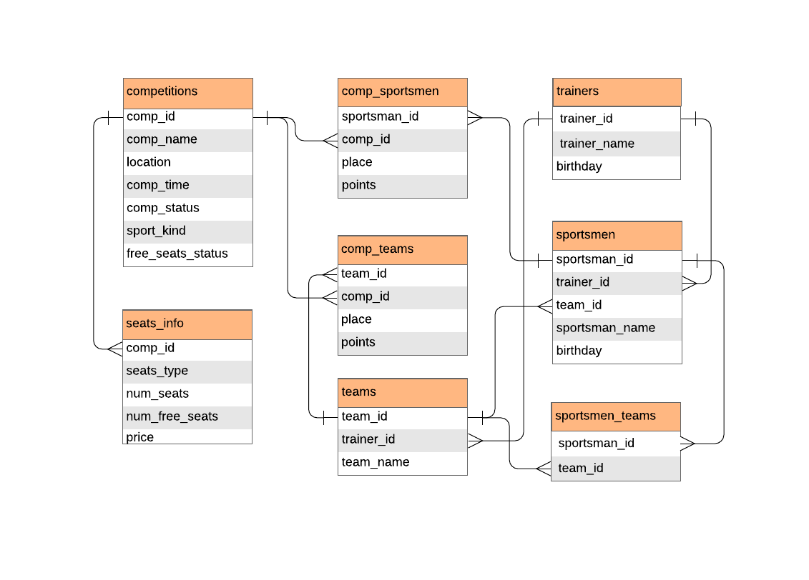

# Практикум по веб-технологиям 2020 г.

## Система учета данных о спортивных соревнованиях и продажи билетов на них.

### Схема базы данных.

### Определение набора страниц, навигации между ними и их содержимого

* Начальная страница содержит ссылки на три страницы: со списком соревнований, списком спортсменов и списком команд.
Далее - на каждой из следующих страниц присутствует ссылка на начальную страницу.
* Страница со списком соревнований содержит список следующих элементов:
	* Название соревнования;
	* Время проведения;
	* Место проведения;
	* Вид спорта.
	Эта страница соответствует таблице competitions базы данных.
	Каждый элемент списка содержит ссылку на страницу конкретного соревнования.
	Также есть поля для фильтрации данных по виду спорта, дате проведения, месту проведения.
	* Для администратора ссылка на страницу для добавления соревнования.
* Страница со списком спортсменов:
	* Имя спортсмена;
	* Ссылка на страницу спортсмена;
	* Для администратора ссылка на страницу для добавления спортсмена.
* Страница со списком команд:
	* Название команды;
	* Ссылка на страницу команды.
	* Для администратора ссылка на страницу для добавления команды.
* Страница соревнования:
	* Название;
	* Вид спорта;
	* Время проведения;
	* Место проведения;
	* Список участников (ссылки на страницы спортсменов или команд);
	* Информация о том, есть ли свободные места;
	* Ссылка на страницу с информацией о местах и ценах (на ней же осуществляется покупка билета) (если соревнования не завершились);
	* Результаты (если соревнования завершились);
	Эта страница соответствует записи таблицы competitions, соединенной с таблицами seat_info, comp_sportsmen, comp_teams.
	* Для администратора есть ссылка на страницу для изменения соревнования и кнопка для удаления соревнования.
* Страница с информацией о местах и ценах:
	* Список видов мест;
	* Для каждого вида - количество свободных мест и цена;
	* Кнопка - ссылка на страницу для осуществления покупки билета.
	Эта страница соответсвует записи таблицы seats_info.
* Страница для осуществления покупки билета:
	* Поле с вариантами ответа: нужно выбрать тип места;
	* Поле для заполнения пользователем: e-mail (на него придет билет);
	* Поле для заполнения: реквизиты карты для оплаты;
	* Кнопка "Купить".
* Страница спортсмена:
	* ФИО;
	* Возраст;
	* История участия в соревнованиях (ссылки на соревнования);
	* История участия в командах (ссылки на команды);
	* Тренер (если есть).
	Эта страница соответсвует записи таблицы sportsmen, соединенной с таблицами comp_sportsmen, sportsmen_teams, trainers.
	* Для администратора есть ссылка на страницу для изменения данных спортсмена и кнопка для удаления данных о спортсмене.
* Страница команды:
	* Название;
	* Состав команды (ссылки на спортсменов);
	* История участия в соревнованиях (ссылки на соревнования);
	* Тренер.
	Эта страница соответсвует записи таблицы teams, соединенной с таблицами comp_teams, sportsmen, trainers.
	* Для администратора есть ссылка на страницу для изменения команды и кнопка для удаления команды.
Для администратора:
* Страница для изменения (добавления) соревнования:
	Редактируемые поля:
	* Название;
	* Время проведения;
	* Место проведения;
	* Список участников (ссылки на страницы спортсменов или команд);
	* Результаты (если соревнования завершились);
	* Кнопка "Применить".
* Страница для изменения (добавления) спортсмена:
	Редактируемые поля:
	* ФИО;
	* Возраст;
	* Тренер (если есть);
	* Кнопка "Применить".
* Страница для изменения (добавления) команды:
	Редактируемые поля:
	* Название;
	* Состав команды (ссылки на спортсменов);
	* Тренер;
	* Кнопка "Применить".

### Определение сценариев использования

1. Получение списка соревнований по видам спорта, участникам, местам и времени проведения:

Переход на страницу со списком соревнований и применение соответствующих фильтров по видам спорта, местам и времени проведения.

Если нужно получить список соревнований по участникам - переход на страницу со списком спортсменов -> страница спортсмена -> список соревнований (аналогично с командами).

2. Получение данных о наличии свободных мест и стоимости билетов разных видов на соревнование:

Переход на страницу соревнования -> страница с информацией о местах и ценах.

3. Покупка билетов:

Переход на страницу соревнования -> страница с информацией о местах и ценах -> кнопка "Купить билет" -> заполнение всех полей -> кнопка "Купить".

4. Добавление и удаление соревнования, чтение и редактирование данных о нем:

Добавление соревнования: Переход на страницу со списком соревнований -> страница для добавления соревнования -> заполнение всех полей -> кнопка "Применить".

Редактирование соревнования: Переход на страницу соревнования -> страница для изменения соревнования -> заполнение полей -> кнопка "Применить".

Удаление соревнования: Переход на страницу соревнования -> кнопка "Удалить".

Чтение данных о соревновании: Переход на страницу соревнования.

5. Добавление и удаление команд и спортсменов, чтение и редактирование данных о них:

Добавление спортсмена: Переход на страницу со списком спортсменов -> страница для добавления спортсмена -> заполнение всех полей -> кнопка "Применить".

Редактирование спортсмена: Переход на страницу спортсмена -> страница для изменения спортсмена -> заполнение полей -> кнопка "Применить".

Удаление спортсмена: Переход на страницу спортсмена -> кнопка "Удалить".

Чтение данных о спортсмене: Переход на страницу спортсмена.

Аналогично для команд.
